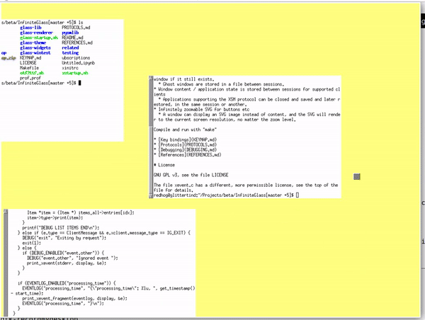

# About

This is a minimalistic compositing window manager for X with infinite
desktop, infinite zoom and infinite virtual window pixel resolution.

Videos:
* [2020 01 27 1](https://www.youtube.com/watch?v=vbt7qtwiLiM)
* [2020 01 21 1](https://www.youtube.com/watch?v=d6oQAOMXReU)
* [2019 11 09 2](https://www.youtube.com/watch?v=E8f2KwgvxK4)

Features:

* Windows are glued to an infinite desktop to some coordinates and size
* Window pixel resolution is independent of their size on the desktop
* The user can zoom / pan to any view of the desktop
* There are shortcut commands to zoom to a window, and to make a window have a 1:1 resolution to the screen
* Window placement is stored between sessions
  * Windows that are closed leave a ghost window in their place that can be moved, resized and deleted.
  * When a window with the same name reappears, it takes the place of the ghost window if it still exists.
  * Ghost windows are stored in a file between sessions.
* Window content / application state is stored between sessions for supported clients
  * Applications supporting the XSM protocol can be closed and saved and later restored, in the same session or another.
* Infinitely zoomable SVG for buttons etc
  * A window can display an SVG image instead of content, and the SVG will render to the current screen resolution, no matter the zoom level.

Compile and run with "make"

* [Key bindings](KEYMAP.md)
* [Protocols](PROTOCOLS.md)
* [Debugging](DEBUGGING.md)
* [References](REFERENCES.md)

# Installation

Tested on: Ubuntu-MATE 18.04 LTS Bionic Beaver.

Requires OpenGL version 3.0 or higher with support for GLSL 3.30, and pretty much all modern X extensions, including their development headers.

To install InfiniteGlass on your machine

    sudo make install

or, if you want to be able to edit the python files in in place without rerunning the install command:

    sudo make devinstall
   
Note that this does not differ from a the above make install with regards to how the non-python binaries are installed.

Once installed, you should be able to select InfiniteGlass among the available sessions when logging in.

# Testing

It is also possible to try the window manager inside a window using the Xephyr X server, without installing anything. To do so, simply run

    make

If your Linux distribution does not have the right libraries or versions of libraries (e.g. X extensions, OpenGL version...) easily installable, you can test the same using a docker container! Just run

    make run-in-docker

# Configuration

Whichever method for running it you use, the first time you run the window manager, a set of default config files will be added to your ~/.config/glass directory. These files can be safely edited, but will be re-instated if deleted.

# Unit- & integration-tests

    make all
    pip install nose2
    nose2 -s tests

# License

GNU GPL v3, see the file LICENSE for details

The file xevent.c has a different, more permissible license, see the top of the file for details.
The file coastline50.geojson has a different, more permissible license, see coastline50.geojson.LICENSE for details.
